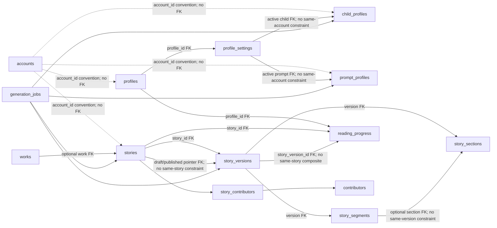

# Panda Pages application baseline audit — 2026-07-14

> Follow-up, 17 July 2026: finding `APP-012` is addressed by forward
> migration `00013_remove_historical_test_fixtures.sql` and the explicit,
> fail-closed local/test seed workflow documented in
> `docs/development/test-fixtures.md`. Migration `00008` remains unchanged as
> applied history; a fully migrated database no longer retains its fixtures.

## 1. Executive summary

Panda Pages is currently a private, passcode-gated story library for one household. Its demonstrated primary journey is: unlock with one shared six-digit passcode, browse an account-scoped published library, read server-rendered stories in scroll mode, and persist progress against an implicitly selected default reader profile. A separately restricted administrator can import or paste Markdown, preview it, create versioned drafts, publish a selected version, and list account-owned stories.

**Overall maturity: early functional/private alpha (2/5).** The main scroll-reading and import/publish paths have meaningful implementation, the database queries are usually scoped, Markdown ingestion has focused safety tests, and repository/CI/runtime boundaries are unusually strong for a small application. The application is nevertheless not dependable enough for unconstrained feature development: Lock does not end authentication, authentication/account identity is asserted by unsigned browser cookies, an ordinary reader-mode switch is broken, progress failures are presented as success, many unrelated failures redirect to unlock, and several visible promises (offline use, personalisation and AI creation) are not backed by working product paths.

**Overall audit confidence: High for implemented code paths and repository configuration; Medium for browser interaction and complete database behaviour.** All current backend/frontend checks and production builds passed, and a disposable PostgreSQL integration run exercised migrations, real API startup, unlock and a database-backed library request. No full browser end-to-end, assistive-technology, device, production, or comprehensive Store integration suite exists.

The five most important findings are:

1. The visible Lock action neither clears the 30-day cookies nor revokes anything; the router sends the still-authenticated browser back to the library (`APP-001`).
2. Authentication and account ownership are client assertions: `pp_unlocked=1` and `pp_aid=<UUID>` are unsigned, `PP_SESSION_SECRET` is unused, and no identity is bound to an account (`APP-002`).
3. Progress PUT failures are swallowed, while the reader advances its `lastSaved` marker and removes the saving state; data can be lost while the interface implies success (`APP-004`).
4. The default scroll-to-paged switch never fetches segments, so the visible paged reader can remain at “Loading pages…” indefinitely (`APP-007`).
5. The administration/data lifecycle is only partial: saving a draft mutates live story metadata, version identity ignores metadata/renderer changes, reverse lifecycle actions are absent, and core Store behaviour has no database integration coverage (`APP-009` to `APP-011`, `APP-019`).

Panda Pages should not start multi-user, sharing, offline-download or AI feature work yet. It can proceed through a deliberately small correction sequence while retaining its current one-household scope. The immediate next action should be a focused **“make session Lock and authentication transitions truthful”** PR: introduce integrity-protected server-recognised session state for the selected default account, add actual logout/cookie expiry, invalidate the frontend auth cache, distinguish transport failure from signed-out state, and add session/router contract tests. It must not introduce sign-up, multiple accounts, profile switching or catalogue sharing.

## 2. Scope and methodology

| Item | Audit record |
|---|---|
| Source commit | `98cd20f2f2b6c350ee7cddc5508277557dead6f2` |
| Source branch | Freshly fetched `origin/main` |
| Documentation branch | `audit/application-baseline`, created directly from that commit |
| Audit date | 2026-07-14 (Europe/London) |
| Repository state | Clean before investigation; no old audit branch was reused |
| Production contact | None. Production hosts, databases, containers, volumes, logs, backups and credentials were not accessed. |
| Behaviour changed | None. This is a documentation-only audit. |

Inspected areas included all application source under `apps/web` and `apps/api`; every migration; frontend and backend tests; both Compose definitions; Dockerfiles; Nginx and Vite/PWA configuration; GitHub Actions; database-role and generated-data test scripts; existing architecture/operations documentation; and relevant Git history/merged PR descriptions. Historical intent was treated only as context and rechecked against the audited tree.

### Confidence scale

- **High** — directly demonstrated by a connected code path plus tests or local execution.
- **Medium** — strongly supported by implementation evidence but not exercised end to end.
- **Low** — inferred from partial implementation, comments, schema or UI only.
- **Unknown** — insufficient evidence.

### Validation executed

The repository-pinned frontend toolchain was Node `v24.18.0` and npm `12.0.1`; the Go module requires Go `1.26.5`. Generated audit-only credentials/data were used where a disposable environment required them. Toolchain commands that the workspace sandbox could not initialise were rerun with explicit approval outside that sandbox; they still operated only on this checkout, local caches, `/tmp`, or disposable local Docker resources.

| Area | Command | Result |
|---|---|---|
| Backend | `cd apps/api && go mod verify` | Pass — all modules verified |
| Backend | `cd apps/api && go test ./...` | Pass — all packages; `internal/db` and `internal/model` have no test files |
| Backend | `cd apps/api && go test -race ./...` | Pass |
| Backend | `cd apps/api && go vet ./...` | Pass |
| Backend | `cd apps/api && CGO_ENABLED=0 GOARCH=amd64 GOOS=linux go build -trimpath -ldflags="-s -w" -o /tmp/pandapages-audit-api-linux-amd64 ./cmd/api` | Pass |
| Frontend | `cd apps/web && npm ci` | Pass — 514 packages installed, 0 audit vulnerabilities; two deprecated transitive warnings |
| Frontend | `cd apps/web && npm run lint` | Pass, zero warnings |
| Frontend | `cd apps/web && npm run typecheck` | Pass |
| Frontend | `cd apps/web && npm test` | Pass — 4/4 Node contract tests |
| Frontend | `cd apps/web && npm run build` | Pass — Vite production build; Workbox precached 12 entries (196.64 KiB) |
| Configuration | `docker compose --env-file /dev/null -f docker-compose.yml config --quiet` with generated audit-only environment values | Pass |
| Configuration | `docker compose --env-file /dev/null -f docker-compose.dev.yml config --quiet` with generated audit-only environment values | Pass |
| Configuration | `env -u PP_ADMIN_IPS docker compose --env-file /dev/null -f docker-compose.yml config --quiet` | Expected exit 1 — missing allowlist failed closed |
| Configuration | `PP_ADMIN_IPS= docker compose --env-file /dev/null -f docker-compose.yml config --quiet` | Expected exit 1 — empty allowlist failed closed |
| Containers | `docker build --target prod --build-arg API_MAIN=./cmd/api --tag pandapages-api:audit apps/api` | Pass; local tag only, no push |
| Containers | `docker build --target prod --build-arg VITE_API_BASE= --tag pandapages-web:audit apps/web` | Pass; local tag only, no push |
| Containers | `docker build --target migrate --tag pandapages-migrate:audit apps/api` | Pass; local tag only, no push |
| Database boundary | `scripts/tests/postgresql-roles-contract.sh` | Pass — 7/7 |
| Disposable integration | `PP_ROLE_TEST_MIGRATION_IMAGE=pandapages-migrate:audit PP_ROLE_TEST_API_IMAGE=pandapages-api:audit scripts/tests/postgresql-roles-integration.sh` | Pass — 12/12; all migrations, real API unlock and database-backed library read; generated resources removed |
| Documentation | `git diff --check` and `git diff --cached --check` | Pass |
| Documentation | `command -v markdownlint-cli2` and `command -v markdownlint` | Unavailable — the repository has no configured Markdown lint; no dependency was added. Headings, classifications, table row counts and balanced fences were checked manually; this slightly reduces formatting-only confidence. |
| Documentation | `rg -n --pcre2 '\[[^\]]+\]\((?!https?://)(?!#)[^)]+\)' docs/audits/pandapages-application-baseline-audit-2026-07-14.md` | No matches — the new document contains no relative Markdown links, so link-target validation is not applicable |
| Documentation | `rg -n -i --pcre2 -e '[p]ostgres(?:ql)?://' -e '[m]ysql://' -e '[m]ongodb(?:\+srv)?://' -e '[r]edis://' -e '-----BEGIN [A-Z ]*[P]RIVATE KEY-----' -e '[g]ithub_pat_[A-Za-z0-9_]{20,}' -e '[g]h[pousr]_[A-Za-z0-9]{20,}' -e '[A]KIA[0-9A-Z]{16}' -e '[x]ox[baprs]-[A-Za-z0-9-]+' docs/audits/pandapages-application-baseline-audit-2026-07-14.md` | No matches |
| Documentation | `rg -n --pcre2 '(?<![0-9])(?:[0-9]{1,3}\.){3}[0-9]{1,3}(?![0-9])' docs/audits/pandapages-application-baseline-audit-2026-07-14.md` | No matches |

No full-stack browser session, accessibility automation, screen reader, physical mobile device, offline browser, load test, concurrent draft test or production environment was used. Existing accessibility dependencies do not exist, so that review is static. Backup/restore suites were not repeated because this is an application audit and no backup code changed; their checked-in contracts were inspected only where they affect application data. Deployment state for repository-described backup/role automation remains **Unknown** and is not inferred from documentation.

Explicit exclusions were implementation changes, production verification, dependency updates, database mutation outside disposable generated environments, deployment, performance capacity claims, and a repeat of the PostgreSQL infrastructure audit. No real credentials, connection strings, public IP addresses or sensitive content are recorded here.

## 3. System overview

The frontend is a Vue 3/TypeScript single-page application built by Vite and styled with Tailwind CSS (`apps/web/package.json`, `apps/web/src/main.ts`). It uses HTML5 history routing and is served in production by unprivileged Nginx with an `index.html` fallback (`apps/web/nginx.conf`). The generated service worker precaches the application shell and route chunks, but not API data.

The backend is one Go HTTP process (`apps/api/cmd/api/main.go`) with separately constructed public and administrator handler stacks. It uses `database/sql` with pgx against PostgreSQL. The public API supplies unlock/status, library, story, segments, progress, continue and settings routes. The administrator API supplies Markdown preview, draft upsert, listing and publication. PostgreSQL holds canonical story Markdown/rendered HTML, versions, segments, profiles, settings and reading progress; the configured asset directory/volume is unused.

Production Compose separates PostgreSQL/migrations on an internal network, the API on internal plus Traefik networks, and the web container on Traefik only. Public API traffic and web traffic have separate ingress routers. Administrator API traffic has a higher-priority route that first applies a required source-IP allowlist and then injects a server-only shared header. Development Compose supplies its own Traefik, omits the production source-IP allowlist, and exposes a loopback API debug port.

Authentication is one shared configured passcode. Successful unlock selects the oldest/default account and returns two 30-day, host-only, HttpOnly, SameSite=Strict cookies. They are Secure in production, but are not signed or server-backed. Administration is not a separate user identity: it combines the unlock cookies with network restriction and a proxy-injected key.

Story ingestion begins in the browser with optional filename parsing, Gutenberg marker removal, HTML-to-text conversion, chapter promotion and H1 preparation. The server validates UTF-8, slug and frontmatter, renders with Goldmark safe defaults, hashes the frontmatter-stripped body, segments top-level blocks, stores a transactional draft/version, and separately publishes a selected version. Readers receive only the account-owned published pointer. Progress attaches to an implicitly created/cached `Default` profile.

Personalisation settings genuinely persist a child profile and prompt rules, but nothing outside the settings UI consumes them. The AI administration route is a timed hard-coded stub. There is no user-managed account, profile switcher, shared catalogue, intentional offline download, asset service, or deletion/retention workflow.

### Reader journey

```text
browser
  → web ingress → Vue route guard → GET /api/v1/auth/status
  → (if locked) POST /api/v1/auth/unlock with shared passcode
  → unsigned unlock + default-account cookies
  → GET account-scoped published library + default-profile continue list
  → GET published story (and, only for initially-paged mode, segments)
  → scroll/paged reader
  → PUT progress for the implicit Default profile
```

### Administrator journey

```text
browser → public web shell and generic unlock guard
  → /api/v1/admin request
  → production Traefik source-IP restriction
  → server-side X-PP-Admin-Key injection
  → Go checks unlock cookie + account UUID syntax + shared admin key
  → preview or transactional draft/version/segments
  → explicit publish pointer update
  → account-scoped published library → reader
```

The web route itself is not administrator-authorised; the privileged boundary applies when it calls the admin API. A source outside the production allowlist can see the static admin shell but cannot use its real API operations.

## 4. Complete feature inventory

No reader-facing feature meets the report's strict **Production-ready** threshold. “Functional but fragile” below means the primary path exists, not that it is suitable for multi-user or unattended production use.

| Feature | Audience | Entry point | Backend support | Persistence | Existing tests | Classification | Confidence | Evidence | Key limitation |
|---|---|---|---|---|---|---|---|---|---|
| F01 Passcode unlock | Reader/parent | `/unlock`; `POST /api/v1/auth/unlock` | `httpapi.New`; `EnsureDefaultAccount` | Select/create oldest `accounts` row; cookies | `TestUnlockSetsSecureHostOnlyCookiesForAllRoutes`; oversized-body test; generated smoke | Functional but fragile | High | `views/Unlock.vue`; `httpapi/api.go:65-114`; `db/store.go:119-167` | Global six-digit secret, no abuse controls; startup accepts unusable non-six-character configuration; all UI failures say “Wrong passcode”; stale auth cache can reject success. |
| F02 Authentication status and route gating | All | Router `beforeEach`; `GET /api/v1/auth/status` | Literal cookie checks | None | No direct/router test | Functional but fragile | High | `router.ts:34-68`; `api.ts:128-133`; `httpapi/api.go:117-124` | Any network/5xx failure becomes “locked”; 5-second cache is not invalidated. |
| F03 Lock/logout/session termination | Reader/parent | Library Lock controls | No logout endpoint | Only local arrays are cleared | None | Incomplete | High | `Library.vue:221-227`; `LibraryHeader.vue:50-59`; no API wrapper/route | Cookies remain; guard redirects the user back to the library. |
| F04 Account selection and session identity | Internal | Unlock cookies | `EnsureDefaultAccount`; cookie middleware | `accounts`; process cache | Generated unlock/library smoke only | Incomplete | High | `store.go:117-167`; `httpapi/api.go:369-384` | Always oldest account; browser controls unsigned account ID; no real identity/switching. |
| F05 Published library listing | Reader | `/library`; `GET /api/v1/library` | `Store.Library` | `stories`, published pointer | Generated database-backed library smoke | Functional but fragile | Medium | `Library.vue:250-265`; `store.go:233-264` | Fixed 100-row limit/no pagination; one continue failure discards list; non-auth errors redirect unlock. |
| F06 Library search and query deep link | Reader | `/library?q=` | Client computed filter | None | None | Functional but fragile | High | `Library.vue:70-134` | Client-only title/author/slug substring search; no announcement/server search. |
| F07 Random story selection | Reader | Library Random | None; `Math.random` over filtered rows | None | None | Functional but fragile | High | `Library.vue:175-181` | Untested, client-only, current filter defines pool. |
| F08 Story card/details metadata | Reader | Story cards/info sheet | Library payload only | `stories` | None | Incomplete | High | `Library.vue:342-471`; `StoryCard.vue` | Shows title/author/slug only; source, rights, language/version unavailable; nested buttons are invalid interaction markup. |
| F09 Scroll story reading | Reader | `/read/:slug`; `GET /api/v1/story/{slug}` | `StoryLatest` | Published `stories`/`story_versions` | Ingestion safety tests only | Functional but fragile | Medium | `Reader.vue:387-408,549-561`; `store.go:268-289` | Primary path exists; no explicit loading/error/retry; every load error redirects unlock. |
| F10 Paged story reading | Reader | Reader Paged; segments endpoint | `StorySegments` | `story_segments` | None | Incomplete | High | `Reader.vue:63-90,387-401,563-578`; `store.go:291-338` | Works only if paged preference was loaded initially; ordinary mode switch never fetches segments. |
| F11 Reader mode switching | Reader | Scroll/Paged buttons | None beyond segment API | Browser preference; progress locator | None | Incomplete | High | `Reader.vue:314-329` | Resets position; scroll→paged stays empty; cross-mode resume does not translate. |
| F12 Chapter navigation | Reader | Paged Chapters drawer | Segment locators/HTML; persisted sections not read | `story_segments`; write-only `story_sections` | None | Functional but fragile | High | `Reader.vue:114-149,291-312`; `db/admin.go:193-295` | Paged/H2-only; depends on broken normal mode-switch path; server sections duplicated client-side. |
| F13 Reading preferences | Reader | Reader Aa drawer | None | `localStorage` `pp_reader_prefs_v1` | None | Functional but fragile | High | `lib/prefs.ts`; `Reader.vue:594-653` | Origin/browser-global, unvalidated shallow JSON, not account/profile-scoped; save can throw. |
| F14 Reading-progress persistence | Reader | `GET/PUT /api/v1/progress/{slug}` | `ProgressGet/Put` | `reading_progress`, implicit profile | None | Functional but fragile | High | `api.ts:259-271`; `Reader.vue:182-225`; `store.go:342-413` | PUT failure is swallowed and treated as saved; pagehide is not reliable delivery; no retry/offline queue. |
| F15 Resume/start-over | Reader | Reader resume prompt | Progress GET/PUT | `reading_progress` | None | Functional but fragile | High | `Reader.vue:228-268,346-384` | Same-version only; cross-mode locators fail; progress GET errors silently remove the option. |
| F16 Continue/recent reading | Reader | Library header/cards; `GET /api/v1/continue` | `ContinueRecent` | Progress + stories | None | Functional but fragile | Medium | `Library.vue:97-159`; `store.go:417-462` | Old-version percent can remain after publish; missing-library slugs disappear; coupled load failure redirects. |
| F17 Child profile persistence | Parent | `/journey`; settings GET/PUT | `SettingsGet/Put` | `child_profiles`, `profile_settings` | None | Functional but fragile | Medium | `Journey.vue:74-159`; `store.go:475-687` | Only one active row is surfaced; no list/switch/delete/clear; load failures look like defaults. |
| F18 Interests | Parent | Journey chips | Settings service | `child_profiles.interests` | None | Incomplete | High | `Journey.vue:25-71,219-253` | Stored but has no story-selection/generation consumer. |
| F19 Sensitivities/avoided topics | Parent | Journey chips | Settings service | `child_profiles.sensitivities` | None | Incomplete | High | `Journey.vue:25-71,255-284` | Stored but not enforced by ingestion, library or generation. |
| F20 Prompt/story-style profile | Parent/internal | Journey style controls | Settings service | `prompt_profiles`, active pointer | None | Incomplete | High | `Journey.vue:31-71,129-159`; `store.go:635-680` | Rules persist, but no real content consumer; success copy overstates effect. |
| F21 Multiple reader profiles | Parent | No entry point | Default-profile helper only | Schema permits rows | None | Incomplete | High | `store.go:169-229`; migration `00007` | Runtime always selects/creates `Default`; no API/UI switch or ownership workflow. |
| F22 Multiple accounts/real users | All | No entry point | Oldest-account helper only | `accounts`; account_id columns | No two-account tests | Incomplete | High | migrations `00011`/`00012`; `store.go:117-167` | No identity, creation or legitimate selection; browser-selected account is unsafe. |
| F23 Shared vs private libraries | Reader/admin | No entry point | Account-scoped story queries only | `stories.account_id` | None | Incomplete | High | `Store.Library/StoryLatest/AdminListStories` | Private-by-account rows exist; no system/shared catalogue or grants. |
| F24 Administrator UI access | Administrator | `/admin/*` | Proxy boundary + `withAdmin` | Account-scoped operations | Admin auth fake-store tests; Compose contract | Functional but fragile | High | `AdminLayout.vue`; `httpadmin/httpadmin.go:65-90`; Compose labels | Static UI and link visible to all unlocked users; API supplies real protection; 403/API failure appears as empty data. |
| F25 Admin Markdown preview | Administrator | `/admin/upload`; `POST /admin/preview` | `AdminPreview` → `storyingest.Ingest` | None | Ingestion unit tests, no preview handler test | Functional but fragile | High | `AdminUpload.vue:315-337`; `db/admin.go:13-38` | Raw error text; no browser/handler contract test. |
| F26 Local file import | Administrator | File picker | Browser helpers only | None until draft | UTF-8 API-client contract only | Functional but fragile | High | `AdminUpload.vue:82-89,419-453` | `accept` is a hint; no size/error handling; `File.text()` hides original byte validity. |
| F27 Gutenberg/Markdown preparation | Administrator | Import pipeline | Browser regex/DOM transforms | Prepared Markdown | None | Functional but fragile | High | `AdminUpload.vue:33-80,438-452` | Heuristic markers/chapters; prepended H1 can displace valid frontmatter; transformations untested. |
| F28 Safe UTF-8/frontmatter/Markdown ingestion | Administrator/internal | Preview/draft | `storyingest.Ingest` | Version HTML/Markdown/segments | UTF-8, malformed-frontmatter, dangerous-URL tests | Functional but fragile | High | `storyingest.go`; `storyingest_test.go` | Strong current safe defaults, but read path trusts stored HTML and coverage is not a full sanitizer matrix. |
| F29 Draft creation | Administrator | Save Draft; `POST /admin/stories/draft` | `AdminDraftUpsert` transaction | Stories, versions, sections, segments, contributors | Fake-store body/UTF-8/limit tests | Functional but fragile | Medium | `db/admin.go:40-340` | No real DB contract test/edit UI; draft save mutates live story metadata; large import has 3-second DB deadline. |
| F30 Story versioning/idempotency | Administrator/internal | Draft by account+slug | Hash lookup, `MAX(version)+1` | `story_versions`, draft pointer | None | Functional but fragile | High | `db/admin.go:109-190`; `storyingest.go:223-224` | Hash excludes metadata/renderer; select-then-insert is concurrency-racy; no history UI. |
| F31 Story publication | Administrator | Save & Publish; publish endpoint | `AdminPublish` | Published pointer + redundant boolean | None | Functional but fragile | Medium | `AdminUpload.vue:341-415`; `db/admin.go:342-377` | Partial draft/publish failure is confusing; no unpublish/archive; progress not reconciled. |
| F32 Story administration/listing | Administrator | AdminUpload lists; `GET /admin/stories` | `AdminListStories` | `stories` | Admin list auth/shape fake-store tests | Functional but fragile | High | `AdminUpload.vue:246-255`; `db/admin_list.go` | Read/open only; failures look empty; draft rows open published-only reader. |
| F33 Source metadata | Administrator/internal | Optional source URL input | Stored in story/source/frontmatter | `stories.source`, version frontmatter | None | Functional but fragile | High | `AdminUpload.vue:119-124,352-358`; `storyingest.go:285-313` | URL is not validated; not shown to readers or editable independently. |
| F34 Rights metadata | Administrator/internal | API type only | Stored arbitrary JSON | `stories.rights` | None | Incomplete | High | `model/admin.go`; `storyingest.go:213-215`; `AdminUpload` omits it | Current UI does not collect it and publication does not enforce it. |
| F35 Contributor metadata | Internal | Draft author | Best-effort contributor/link upsert | `contributors`, `story_contributors` | None | Functional but fragile | High | `db/admin.go:133-151,308-325` | Never read; old authors accumulate; write errors are ignored. |
| F36 Works/canonical catalogue | Internal | No entry point | No runtime methods | `works`, `stories.work_id` | Migration suite only | Unused/dead | High | migration `00004`; seed migration; repository references | Schema/fixtures only; not evidence of shared catalogue. |
| F37 AI story creation | Administrator | `/admin/ai` | No endpoint/service | `generation_jobs` schema unused | Static test only confirms route split | Stub | High | `AdminAI.vue:11-20`; migration `00003` | 300 ms delay and hard-coded result; age/length ignored; no save/provider/safety boundary. |
| F38 PWA manifest/install surface | Reader | Browser install heuristics | Generated manifest | Browser install state | Static PWA contract test; production build | Functional but fragile | High | `vite.config.ts:36-53`; `public/logo.png` | Same 300×300 PNG is falsely declared 192×192 and 512×512; install not exercised. |
| F39 Service-worker update prompt | Reader | App banner | `useRegisterSW`, prompt update | Workbox caches | No runtime test; build generated SW | Functional but fragile | Medium | `App.vue`; `vite.config.ts` | No update-failure/retry telemetry; prompt can overlap reader UI. |
| F40 Offline application shell | Reader | Generated service worker | Precache/navigation fallback | Workbox cache | Static contract test; generated build inspected | Functional but fragile | High | `vite.config.ts:55-65`; built `sw.js` | Shell/chunks only; protected navigation immediately needs auth status. |
| F41 Offline stories/auth/progress | Reader | No entry point/download | APIs explicitly not runtime-cached | None/failed network | Static no-runtime-cache test | Incomplete | High | Workbox config; `api.ts`; `App.vue:26` | No story download, unlock, queue or reconciliation; “ready to use offline” is misleading. |
| F42 Health/liveness | Operator | `/healthz`; Docker HEALTHCHECK | Constant `200 ok` | None | No endpoint test | Functional but fragile | High | `httpapi/api.go:59-63`; API Dockerfile | Process liveness only; all methods accepted; no database/readiness signal. |
| F43 Logging and panic recovery | Operator | API runtime | `slog`, middleware recovery | Logs only | No behaviour test | Incomplete | High | `main.go`; both handler helper stacks | Startup/fatal/panic only in practice; debug level never configured; no status/latency/request ID/audit. |
| F44 Database migrations | Operator | Goose one-shot before API | Migrations `00001`–`00013` | Full schema; historical fixtures removed | Generated PostgreSQL suite tests fresh and upgraded paths | Functional but fragile | High | Compose migrate service; fixture integration test | Historical seed migration `00008` remains applied history; forward migration `00013` leaves the current migration result clean. |
| F45 Least-privilege DB runtime boundary | Operator/internal | Separate runtime/migration roles | Role scripts and Compose credentials | PostgreSQL roles/ACLs | 7 contract + 12 generated integration checks | Production-ready | High | `deploy/postgresql-roles`; `scripts/tests/postgresql-roles-*`; CI | Strong repository contract for current tables; actual deployment state is outside this audit. |
| F46 Backup/restore application assumption | Operator | External scripts/systemd docs | Database logical backup; no app endpoint | PostgreSQL; separate assets volume excluded | Existing generated backup suites (not rerun) | Functional but fragile | Medium | operations docs/scripts | Current core content is DB-resident, but deployment state is unknown and future assets are excluded. |
| F47 Asset/cover storage | Administrator/reader | No entry point | No handler/store | `assets`, `cover_asset_id`, volume | None | Unused/dead | High | migration `00002`; Compose `PP_ASSET_DIR`/volume | Configured but unused; cover ID has no FK; dev `/assets` routes to an API with no handler. |
| F48 SPA deep-link refresh | All | Direct known route | Nginx and SW fallbacks | Static files/cache | Build/static config only | Functional but fragile | High | `nginx.conf:14-16`; Workbox navigation fallback | Known routes refresh; unknown routes render a blank SPA because there is no 404 route. |
| F49 Haptics | Reader | Pointer interactions | Browser vibration helper | Origin `localStorage` | None | Functional but fragile | High | `lib/haptics.ts` | Unsupported browsers safely no-op; hidden setter has no UI; preference is browser-global. |
| F50 Data deletion/retention | Account owner/operator | No entry point | No application lifecycle endpoints | All account/profile/story data | None | Incomplete | High | Endpoint/store inventory | No delete/export/retention contract for child data, progress, accounts or stories. |

## 5. Frontend route map

All routes use `createWebHistory`. Reader, Journey and both admin children are lazy-loaded; Unlock and Library are in the initial bundle. `requiresUnlock` is inherited through matched parent records.

| Route | Component | Guard | Intended audience | API dependencies | Primary states | Classification |
|---|---|---|---|---|---|---|
| `/` | Redirect | Redirects to guarded `/library` | Reader | Status through target | Redirect | Functional but fragile |
| `/unlock` | `Unlock.vue` | Always calls cached status; if true, redirects to string `next` or `/library` | Reader/parent | GET status; POST unlock | Empty/partial/six digits, busy, success, shake/error | Functional but fragile |
| `/library` | `Library.vue` | `requiresUnlock` | Reader | GET library, continue (`limit=4`), settings | Skeleton, populated, no stories, no match, info sheet, continue/recent | Functional but fragile |
| `/read/:slug` | Lazy `Reader.vue` | `requiresUnlock`; route declares props but component snapshots `route.params.slug` | Reader | GET story; conditional segments; progress GET/PUT | Blank load, scroll, paged, resume prompt, controls/chapters drawers | Functional but fragile |
| `/journey` | Lazy `Journey.vue` | `requiresUnlock` | Parent | settings GET/PUT | Three form steps, save/error/success | Incomplete |
| `/admin` | Lazy `AdminLayout.vue` | Generic `requiresUnlock` only | Administrator | Child-dependent | Layout and nested redirect | Functional but fragile |
| `/admin/` (empty child) | Redirect to relative `upload` | Inherits parent | Administrator | None | Redirect | Functional but fragile |
| `/admin/upload` | Lazy `AdminUpload.vue` | Generic unlock; privileged API enforces real boundary | Administrator | library; admin list/preview/draft/publish | Form, import, preview, lists, errors, success auto-route dialog | Functional but fragile |
| `/admin/ai` | Lazy `AdminAI.vue` | Generic unlock | Administrator | None | Prompt, fake generating, hard-coded result | Stub |
| Unmatched path | No route/component | No unlock requirement because nothing matches | Any | None | Blank `router-view` | Incomplete |

`q` is the only supported route query on `/library`; `next` is consumed on `/unlock` without validation. `slug` is the only route parameter. There are no named routes, catch-all, route-level error components or router error hooks.

Known-route direct navigation and refresh work online because Nginx falls back to `index.html`; immutable hashed `/assets/` misses remain real 404s. Workbox also supplies the shell for history navigation after installation. Unknown web paths are also handed to the SPA, but then render blank. An unavailable backend is not handled correctly: status converts all failure to signed-out, Library/Reader redirect on broad catches, and admin list failures become empty states.

The guard has two contradictory transition defects:

- A cached `false` from entering Unlock can survive the successful POST and send the valid next navigation back to Unlock for up to five seconds.
- Lock navigates to Unlock while the cookie and often cached `true` remain; the guard immediately returns to Library. There is no cache invalidation API.

Frontend authorization is intentionally weaker than backend administrator authorization. That is acceptable only if the distinction is explicit: an unlocked user can reach the admin shell and AI stub, while real admin API calls require ingress/network and backend controls. Today failures do not explain that boundary.

## 6. API endpoint map

`apps/api/cmd/api/main.go` mounts the admin handler at `/api/v1/admin/` before the public handler at `/`. “Authentication” below means the two current cookies; “authorization” is separated from the network allowlist and proxy key.

| Method | Path | Handler | Authentication | Authorization | Request limit | Main response | Error behaviour | Persistence | Tests |
|---|---|---|---|---|---|---|---|---|---|
| Any | `/healthz` | Inline public closure | None | None | Body ignored | `200 text/plain: ok` | Never checks dependencies; all methods succeed; no `no-store` | None | None |
| POST | `/api/v1/auth/unlock` | Public unlock | Public passcode | Selects global default account | 1 MiB strict JSON | `{ok:true}` plus two cookies | JSON 400/413/401/500; manual JSON 405 + `Allow` | May insert account | Cookie/oversize tests; generated real unlock |
| GET | `/api/v1/auth/status` | Public status | None | Literal cookie inspection | None | `{unlocked:boolean}` | JSON 405; never validates account/DB/session | None | None |
| GET | `/api/v1/library` | `Store.Library` | Unlock + nonempty account cookie | SQL `stories.account_id` predicate | None | Up to 100 title/author/slug items | Signed-out 401 occurs before method check; generic JSON 500 DB | Stories | Generated library smoke only |
| GET | `/api/v1/story/{slug}` | Prefix handler → `StoryLatest` | Same | Account-scoped published pointer | None | Story metadata, version, rendered HTML | JSON 400 invalid path, 404 row, generic 500 | Stories, versions | None |
| GET | `/api/v1/story/{slug}/segments` | Prefix handler → `StorySegments` | Same | Account-scoped published pointer | None | Version plus all ordered segments | JSON 400/404/generic 500; no response cap | Stories, versions, segments | None |
| GET | `/api/v1/progress/{slug}` | `ProgressGet` | Same | Story account predicate + implicit profile | None | Version/locator/percent | Any no-row, including missing story, becomes zero-state 200; generic 500 | May create profile; reads progress | None |
| PUT | `/api/v1/progress/{slug}` | `ProgressPut` | Same | Verifies account story and version belongs to story | 1 MiB strict JSON | `{ok:true}` | 400 version/JSON, 413, 404 story/version; null `locator` reaches the database `NOT NULL` constraint and becomes generic 500; percent clamps | Upserts progress | None |
| GET | `/api/v1/continue?limit=N` | `ContinueRecent` | Same | Account story + implicit profile | None | Recent slug/percent/time items | Malformed defaults silently; clamps 1–10; generic 500 | May create profile; reads progress/stories | None |
| GET | `/api/v1/settings` | `SettingsGet` | Same | Default profile and account-filtered child/prompt joins | None | Active child/prompt | Nominal no-row empty; otherwise generic 500 | GET may create profile/settings row | None |
| PUT | `/api/v1/settings` | `SettingsPut` | Same | Updates IDs only when account matches; otherwise inserts | 1 MiB strict JSON | Saved child/prompt | Generic 500 for validation/cast/DB; weak domain validation | Child, prompt, active settings | None |
| POST | `/api/v1/admin/preview` | Admin preview → ingest | Unlock + UUID-shaped account | Proxy-injected key; production source allowlist before Go | 20 MiB strict JSON | Rendered HTML and segments | Decode 400/413; raw ingestion text as `preview_failed` 400 | None | Ingestion tests only |
| POST | `/api/v1/admin/stories/draft` | Admin draft upsert | Same | Same; account passed to Store | 20 MiB strict JSON | Story/version IDs, version, segment count, HTML | Decode 400/413; every Store/DB failure exposed as raw `draft_failed` 400 | Story/version/sections/segments/contributors | Fake-store UTF-8/oversize tests |
| GET | `/api/v1/admin/stories` | Admin list | Same | Same; account-scoped query | None | Up to 200 admin rows | Raw Store error as 400; mux plaintext 405 | Stories | Authorised/signed-out/invalid credential fake-store tests |
| POST | `/api/v1/admin/stories/{slug}/publish` | Admin publish | Same | Same; Store verifies version belongs to account story | 20 MiB strict JSON | `{ok:true}` | Missing slug/JSON 400; not-found/cast/DB raw `publish_failed` 400 | Story publish pointer/flag | None |

### Cross-endpoint HTTP contract

- Public JSON bodies are capped at 1 MiB and admin JSON bodies at 20 MiB. Both decoders reject unknown fields and trailing values, but accept duplicate keys with last-value semantics and do not require `Content-Type: application/json` or inspect `Accept`.
- Public handled responses and errors use JSON and `Cache-Control: no-store`. Admin handled responses do the same. Default `ServeMux` 404/405 responses are plaintext and lack that cache policy.
- Public protected handlers authenticate before checking methods, so a signed-out wrong-method request receives 401 while an authenticated one receives 405. Method-aware admin patterns reject wrong methods in the mux before admin authentication and return default plaintext 405.
- Public authentication failures are 401. Admin missing unlock/account is 401; a missing/wrong injected key is 403. A production source outside the allowlist is rejected by Traefik before Go, also as a different 403. These are authentication, application authorization and network restriction respectively—not equivalent controls.
- Story prefix parsing rejects extra path parts, while progress treats the whole trimmed suffix (including `/`) as a slug. Runtime reads do not reuse ingestion slug validation. Unknown query parameters are ignored; `continue.limit` defaults/clamps instead of rejecting.
- Panic recovery returns JSON 500 and logs the path/recovered value, but has no stack/request ID and cannot safely replace an already-written response.
- Both API stacks set `X-Content-Type-Options`, `Referrer-Policy`, `Permissions-Policy` and `X-Frame-Options`. The Nginx web config sets no corresponding application security headers; no app-level CSP or HSTS exists.
- Public DB failures return safe generic text. Admin maps validation, conflict, missing, timeout and internal DB errors alike to 400 with `err.Error()`, which can leak constraint/SQL details. The frontend explicitly searches those details for duplicate-content strings.
- SQL statements use parameter placeholders throughout. No caller-controlled SQL interpolation was found.
- Frontend wrappers exist for every application endpoint except operational health. There is no live AI wrapper. No logout, account, profile-list/switch, version-list/restore, edit, unpublish/archive/delete, readiness or metrics endpoint exists.

Contract types are manually duplicated and already drift: backend null authors may be omitted while the frontend declares `string|null`; empty settings can emit JSON null and are normalized client-side; the admin backend returns language/timestamps/version pointers omitted by the frontend type.

## 7. Account, profile, child and story ownership model

### Account identity

The actual identity flow is:

```text
global passcode match
  → select/cache oldest accounts.id
  → browser receives pp_unlocked=1 and pp_aid=<that UUID>
  → each protected request trusts both cookie values
  → Store uses pp_aid as the account scope
```

`pp_unlocked` and `pp_aid` are host-only, HttpOnly, root-path, SameSite=Strict and 30-day Max-Age; production sets Secure. Those flags are useful and tested. The values are neither signed nor encrypted, no server session exists, and Compose's `PP_SESSION_SECRET` is unused. Public middleware requires only literal `1` plus a nonempty account value; admin additionally checks UUID syntax. Account existence is not checked at the boundary. A malformed public value generally becomes a database 500; an arbitrary valid UUID is accepted as scope.

Legitimate users cannot create, select or switch accounts; all receive the oldest account. Multiple database account rows can exist, but other rows are unreachable through legitimate UI and reachable by manufactured cookie if their UUID is known. This is transitional single-household scoping, not multi-user ownership.

### Profiles and child/prompt settings

For each asserted account ID, `getDefaultProfileID` selects or lazily inserts the oldest profile named `Default`, then caches it indefinitely in a mutex-protected process map. Every progress/settings operation uses that profile. There is no invalidation if rows are externally changed.

The schema permits multiple profiles, child profiles and prompt profiles. The runtime exposes only one active child/prompt pair through `profile_settings`; it has no list/switch/delete/clear contract. Journey preserves returned IDs so repeated saves update the active pair. A foreign/missing child or prompt ID is not reported as forbidden/not-found: update affects zero rows and a new owned row is inserted, leaving the prior row. Application joins add account predicates, but the database does not enforce same-account relationships.

Child data includes name, age in months, interests and sensitivities. Prompt data includes name, schema version and arbitrary rules. No library, reader, ingestion or generation operation consumes either. `generation_jobs` is schema/fixture-only.

### Stories

Every story has a non-null `account_id`, and reader/admin Store queries consistently predicate on it. Slug uniqueness is `(account_id, slug)`. Stories—not profiles—own the library, so future profiles within one account would share it. There is no shared/system story flag, catalogue grant, or private-vs-shared join.

Stories own versions through `story_versions.story_id`; story-level draft/published UUID pointers separately reference versions. The database does not constrain those pointers to versions of the same story, though current publish code verifies it. Versions own sections/segments; a segment's optional section FK does not constrain both to the same version. Progress separately references profile, story and version without a composite same-owner/same-story invariant. Application writes check important relationships, but schema integrity is weaker than the model suggests.

Contributors are global and linked to stories. Works are global schema scaffolding. Source and rights are story-level JSON, while a merged copy also appears in version frontmatter. There is no delete/retention lifecycle.



Dashed edges above are deliberately not database foreign keys. `generation_jobs` has independent nullable FKs but no account-consistency constraint. `stories.cover_asset_id` is not an FK and is omitted from the relationship graph rather than inventing one.

## 8. Story lifecycle and ingestion model

### Actual lifecycle

```text
local .txt/.md/.html or pasted Markdown
  → browser filename/Gutenberg/chapter/H1 assistance
  → admin preview (optional)
  → admin draft JSON
  → UTF-8, required-field, slug, YAML-frontmatter validation
  → Goldmark rendering with raw/dangerous content omitted
  → SHA-256 of frontmatter-stripped body
  → top-level AST segmentation + H2 chapter detection
  → transaction: story metadata + version + sections + segments + draft pointer
  → optional separate publish request
  → account-scoped published pointer
  → reader full HTML or segments
  → profile/story/version progress
```

Browser assistance parses `Title - Author` filenames; normalizes newlines; converts imported HTML to `innerText`; strips recognized Project Gutenberg start/end markers; promotes lines beginning Chapter/Book/Letter/Part to H2; and prepends an H1 when missing. It is heuristic and untested. Unicode-only titles can slugify empty; the 80-character cut can leave a trailing hyphen. Prepending H1 before leading YAML means otherwise valid frontmatter no longer starts the document. `File.text()` decoding also means server UTF-8 validation proves the JavaScript string, not original bytes.

Server ingestion validates UTF-8 for its primary string inputs, requires title/slug/Markdown, enforces lowercase alphanumeric hyphen slugs, caps YAML frontmatter at 64 KiB, rejects malformed YAML, and defaults language. The apparent title fallback from frontmatter is unreachable because empty title is rejected before frontmatter parsing; draft code also supplies default language before parsing. Source URLs are trimmed/stored but not URL-validated. Rights are arbitrary JSON.

Goldmark's default safe renderer omits raw HTML and dangerous URL forms. Existing tests demonstrate representative script/event-handler/JavaScript URL rejection and UTF-8 handling. The read path does not re-sanitize stored `rendered_html`, so safety assumes all rows entered through the current ingester and were not altered by another writer.

The whole rendered body and one rendered segment per top-level Markdown AST block are produced. H2 segments create persisted chapter rows; content before the first H2 is unsectioned. Without H2, one generic section is created. Runtime never reads `story_sections`; the frontend derives chapters again from segment locator/HTML. UTF-8 is covered; complex lists, quotes, code blocks, section assignment and very large works are not.

### Version and draft semantics

The content hash covers only frontmatter-stripped Markdown body. An existing `(story_id, content_hash)` is reused and becomes the draft pointer. Consequences:

- frontmatter-only changes do not create or update a version;
- title/author/source/rights may change at story level while the old version/frontmatter remains;
- a renderer/sanitizer upgrade cannot re-render identical Markdown into a new version;
- the returned segment count can describe current processing while persisted segments are old.

Saving any draft first upserts story-level metadata. For an already-published story, an unpublished draft therefore changes the live library/reader title and author while the old published body remains. Contributors only accumulate; failed contributor writes are ignored.

New version numbers use `MAX(version)+1`, after a separate hash lookup. Concurrent same-story drafts can collide on content/version unique constraints; there is no row/advisory lock or retry. One transaction contains serial section/segment inserts under the Store's single three-second deadline, which conflicts with the 20 MiB large-book HTTP allowance.

Draft content can be created again by resubmitting a slug, but there is no API/UI to retrieve a draft body, edit an existing version explicitly, list/compare versions, restore a version or edit metadata independently. Publishing verifies the chosen version belongs to the account-scoped story, then sets both pointer and `is_published`. Reader queries trust only the pointer while admin listing reports the boolean, so duplicate state can drift. No unpublish, archive or delete action exists. Rights are stored, not enforced as a publish gate.

Publishing a new version does not migrate/reset progress. Existing progress continues to reference the old version; Reader declines to resume on version mismatch, while Continue can still show its old percentage until another save. Progress may be written for any version belonging to the story, not necessarily the published pointer.

AdminUpload's two-request draft/publish sequence is not atomic. If publish fails, the draft remains but the UI reports the overall save as failure. If “publish” is unchecked, the success dialog still says it will open the reader and auto-navigates after 600 ms; a brand-new draft is not reader-visible, causing story 404 followed by Reader's unrelated unlock redirect.

## 9. Security and privacy boundaries

Authentication, authorization, network restriction, account ownership and session integrity are evaluated separately here.

| Boundary | Type | Assessment | Evidence and implication |
|---|---|---|---|
| TLS/public ingress routing | Network | Effective for current single-user scope but not extensible | Production Compose separates web/public API/admin routes through TLS-enabled Traefik and exposes no API host port. External Traefik operation was not tested. |
| Admin source-IP allowlist | Network restriction | Effective for current single-user scope but not extensible | Required/fail-closed Compose interpolation and higher-priority admin route; local contract tests pass. Dynamic addresses remain an operational dependency. |
| Proxy-injected admin key | Authorization component | Effective for current single-user scope but not extensible | Key stays server-side; frontend test checks no browser header; backend constant-time compares it. It identifies no human and yields no audit trail. |
| Global passcode verification | Authentication | Fragile | Public six-digit equality check, no rate limit/delay/lockout/failure log; non-six configured passcode starts healthy but can never unlock. |
| Unlock cookies | Authentication assertion | Fragile | Good Secure/HttpOnly/SameSite/host-only flags, but literal values can be manufactured. |
| Session integrity | Session integrity | Absent | No server session/signature; configured session secret unused. |
| Session expiry/revocation | Session lifecycle | Incomplete | Browser Max-Age only; no server expiry/rotation/revocation/device state. |
| Logout/Lock | Session lifecycle | Absent | No endpoint or cookie clearing; UI route change is reversed by auth status. |
| Account ownership | Ownership | Absent | No identity-account binding; browser cookie chooses SQL scope. |
| Current account SQL predicates | Authorization/scoping | Effective for current single-user scope but not extensible | Reader/admin story queries consistently predicate `account_id`; that ID is client asserted. |
| Future horizontal access control | Authorization | Incomplete | Knowledge/replay of another account UUID selects its data; no two-account integration tests. |
| Referential account ownership | Data integrity | Incomplete | Account-scoped tables have no FKs to `accounts`; cross-owner pointer consistency is not enforced. |
| Profile/child privacy | Privacy | Incomplete | Account-scoped joins/updates help, but shared forgeable session/account boundary protects child data. No deletion contract. |
| CSRF | Request integrity | Effective for current single-user scope but not extensible | SameSite=Strict, Secure cookies, same-origin deployment and no CORS reduce risk; no Origin/token check and JSON content type is not enforced. |
| SQL injection | Data access | Effective | Store inputs are parameterized; no dynamic caller-controlled SQL found. |
| Markdown/HTML safety | Content integrity | Effective for current single-user scope but not extensible | Safe renderer and focused tests; historical/stored HTML is trusted at read time, and no web CSP provides defense in depth. |
| Source URL and rights | Content governance | Incomplete | URL unvalidated; rights arbitrary/stored only; no reader display or publication enforcement. |
| Request body/JSON controls | Input boundary | Effective | 1 MiB/20 MiB limits; unknown/trailing JSON rejected; 413 distinguished. |
| Identifier validation | Input/ownership | Fragile | Slug strong only at ingest; public account cookie merely nonempty; runtime paths differ; UUID casts can surface as admin raw errors. |
| HTTP timeouts | Availability | Effective for current single-user scope but not extensible | Bounded server/pool/query timeouts and tested server configuration; DB work ignores request cancellation and large drafts share 3 seconds. |
| API error confidentiality | Privacy | Fragile | Public DB details hidden; admin returns raw Store/SQL details to the browser. |
| Service-worker caching | Browser data | Effective for current single-user scope but not extensible | No authenticated API runtime caching, so current SW does not leak one account's stories/settings to another browser user. Local preferences remain shared. |
| Production bundle secrets | Secret boundary | Effective | Fixed same-origin API, no browser admin key, contract test/build evidence; no production source maps generated. |
| Logging sensitive data | Privacy | Effective for current single-user scope but not extensible | Current logs only method/path when debug would be enabled; no body/cookie logging. Observability is correspondingly absent. |
| Data deletion/retention | Privacy lifecycle | Absent | No application export/delete/retention APIs for child/profile/progress/story/account data. |
| Future AI provider boundary | Privacy/safety | Absent | No provider exists, but schema/UI collect child preferences without consent, minimisation, provider, moderation or retention decisions. |

The unsigned cookie design is a serious boundary defect, but this audit does not claim automatic compromise: an attacker still needs a target account UUID to select another account. It is unsuitable for the intended next stage and must be corrected before multiple real users exist. The current global passcode's online guessing exposure is independent of cookie integrity and should receive its own focused control after session correctness.

## 10. Accessibility review

This is a **static source review only**. No browser accessibility tree, keyboard session, screen reader, device, automated contrast calculation or assistive technology was used. The repository has no accessibility test dependency or lint plugin. Severity is based on source-observable task impact; rendered/device findings remain Medium confidence unless the code path is definitive.

### Findings

| Severity | Finding | Evidence and impact |
|---|---|---|
| High | Admin success dialog changes context after only 600 ms and is not keyboard/AT controlled | AdminUpload.vue:148-201,481-553: focus is never moved, trapped or restored; keyboard use does not cancel the timer; Escape is on an unfocused outer element; background is not inert; dialog lacks an accessible name. Actions are unreliable and navigation is unexpected. |
| High | Unlock's actual hidden textbox has no accessible label | Unlock.vue:208-248: the visual passcode bubble is a separately focusable role=button with aria-label; the native focused input is sr-only without its own label/name or error association. Screen-reader unlock context is unreliable. |
| Medium | Library info, Reader chapters/settings, and resume overlays are not accessible dialogs/statuses | Library.vue:423-471; Reader.vue:477-547,581-655: no complete dialog semantics, focus move/trap/restore, inert background or consistent body lock. Reader drawers lack Escape handling. Library's global Escape helps, but its visual backdrop child does not trigger the parent's self-click handler. |
| Medium | Story cards contain nested interactive buttons | Library.vue:342-359 renders StoryCard's info button inside an outer story button (StoryCard.vue:79-90), creating invalid markup and ambiguous keyboard/click behaviour. |
| Medium | Several form controls lack programmatic labels | Library search is placeholder-only; Journey nickname/age labels are separate without for/id; interests/sensitivities use placeholders. Admin/AI wrapping labels and the publish checkbox are positive counterexamples. |
| Medium | Dynamic state and route changes are mostly silent | Errors, success, loading, saving, search counts and visual reader progress generally lack alert/status/live or semantic progress attributes. The service-worker banner correctly uses aria-live=polite. Route changes do not move focus or update the document title. |
| Medium | Reader control state is visual only | “Aa” has an ambiguous name; Chapters/Aa lack expanded/controls state; mode/theme choices lack pressed/radio semantics; current range values are not presented. |
| Medium | Focus visibility and touch targets need rendered verification | Multiple inputs explicitly remove outlines and some supply only subtle border changes. Small info/search/header controls appear below a 44 px target from their utility sizing. No consistent focus-visible system is present. |
| Medium | Paged/chapter navigation is not robust for keyboard/AT | Native horizontal scrolling has no region label/instructions or next/previous controls. Range inputs are wrapped in labels (a strength), but page/percent changes are not announced. |
| Medium | Reduced-motion handling is incomplete | Unlock background and Library shimmer respect reduced motion, and haptics disable; shake, smooth scroll, common transitions/scales and admin auto-navigation do not. |
| Low | Decorative emoji are spoken as part of labels | Most icon-only controls have accessible names and emoji buttons also contain words, but decoration is not hidden consistently. |

Semantic heading structure is broadly coherent at the application level, native buttons/links are used extensively, the viewport does not disable zoom, and HTML sets lang=en. Story-provided Markdown can add another H1 beneath the Reader H1. Colour contrast cannot be certified statically; small opacity-60/70 text on dark translucent surfaces needs rendered measurement. Large text/zoom wrapping is unverified.

## 11. Mobile and responsive behaviour

The implementation is deliberately mobile-first: one-column base layouts become two/three-column library grids and wider admin/reader grids at breakpoints; most pages use min-h-dvh; Unlock, Library, Reader header and Admin use safe-area insets; headers are sticky; Library has a mobile action stack; cards/lists truncate long text; and Reader title/body wrap with configurable font/line-height/max-width.

Deliberately implemented mobile behaviours include native scroll/momentum/snap for paged reading, passive scroll listeners, pointer-triggered optional haptics, fixed/sticky controls, body scroll locking for the admin success modal, and reduced-motion guards for some animation/haptics. Unsupported vibration safely no-ops.

Fragile or browser-dependent behaviour includes:

- “Swipe” is browser-native horizontal overflow, not gesture logic. Pages are fixed at one or two segments rather than viewport height, so a page may also require body scrolling.
- No resize/orientation handler realigns scrollLeft to page times clientWidth; rotation can leave the viewport between pages and currentPage stale.
- Scroll-to-paged is broken; all mode switches reset to the start; cross-mode progress is not translated.
- Reader/Library sheets do not lock the body; only the admin modal does. No visualViewport handling exists for mobile keyboard changes.
- The update banner lacks safe-area bottom padding and can overlap Reader's resume prompt/floating controls.
- Journey lacks explicit safe-area padding, and Reader content has no bottom inset. Dynamic viewport units, scroll snap and vibration support remain browser-specific.
- Long card/admin titles are deliberately line-clamped/truncated, losing information; Reader/modal titles wrap. Large-text and 200% zoom behaviour is untested, and two-column form/control groups may crowd.
- The width preference's 520–920 px value is a max-width rather than a forced viewport width, but its usefulness on narrow phones is limited.
- There is no physical-device evidence for phones, tablets, desktop browsers, orientation changes, virtual keyboard, touch target accuracy or haptic behaviour.

Desktop is a responsive fallback rather than a separately designed workflow. It gains wider grids and controls, but the interaction model (bottom sheets, swipe language, mobile auto-navigation) remains mobile-oriented.

## 12. PWA and offline review

VitePWA uses generateSW with prompt registration. The manifest declares ID/start/scope /, standalone display with minimal-ui/browser fallbacks, and matching dark theme/background. App.vue registers through useRegisterSW, announces an offline/update banner politely, and lets the user trigger updateServiceWorker(true).

The generated production service worker precached 12 entries (196.64 KiB): index.html, hashed CSS/main, every lazy route chunk, Workbox support, logo and manifest. It cleans outdated precaches and uses /index.html as navigation fallback while denying /api/*, /assets/* and /healthz. No runtimeCaching, background sync or API strategy exists.

| Scenario | Actual contract |
|---|---|
| First install | Browser heuristics may offer install after manifest/SW criteria; not browser-tested. |
| Icons | Both 192×192 and 512×512 entries point to one actual 300×300 RGBA PNG. Metadata is false; no maskable icon. |
| No network, shell already installed | Static shell, styling, lazy route chunks, logo and route navigation fallback can load. Local reader/haptic preferences remain. |
| No network, protected navigation | Guard calls status; fetch failure becomes unlocked=false; browser is redirected to Unlock. |
| No network, unlock/library/story/segments/settings/admin | Do not work; no API response is cached. |
| Network drops while story is already rendered | Existing DOM remains until refresh/navigation; this is not durable offline availability. |
| Progress while offline | PUT failure is swallowed and treated as saved; no queue/reconciliation occurs on return. |
| Update | New precache waits for user prompt; current client remains on old assets until applied. No failure telemetry/retry UI. |
| Logout/account change | SW contains no authenticated story/settings responses, so it does not currently expose one account's API data to another local browser user. Shell/admin code is non-secret; local preferences are shared. |

There is no intentional story download, content availability indicator, stale-story policy, cache quota/eviction UX, conflict resolution or reconnection reconciliation. The user-facing “Panda Pages is ready to use offline” wording is therefore inaccurate: only the application shell is ready, while the product's authentication, library, stories and persistence are not. Copy should describe shell installation until a real offline-content contract exists.

## 13. Error handling review

The current propagation path is:

~~~text
database/service raw error
  → public generic 500 OR admin raw 400 (plus selected 400/401/403/404/413 cases)
  → JSON/plain HTTP response
  → frontend request() parses JSON or text into APIError
  → each component independently redirects, suppresses, exposes or relabels it
~~~

The frontend request helper is a genuine strength: one same-origin URL path, credentials included, JSON headers for string bodies, structured error extraction and plain-text fallback. It has no timeout/cancellation/retry and casts successful malformed/non-JSON bodies to the expected type.

| Error case | Current behaviour | Dependability impact |
|---|---|---|
| Backend validation/malformed JSON | Strict unknown/trailing rejection; parser details returned as 400 | Useful but field/duplicate/content-type semantics inconsistent. |
| Oversized request | 413 on public/admin decoders | Correctly distinguished. |
| Database failure | Public generic 500; admin raw error as 400; handled failures not logged | Admin can expose internals; operators lack evidence; client cannot distinguish retryable failure. |
| Authentication failure | JSON 401 | Correct status at API, but frontend often handles all errors as authentication. |
| Admin key/network restriction | Go 403 or proxy 403 | Correct separate boundaries, but UI generally displays empty/list failure rather than explaining access. |
| Missing story | Reader API JSON 404 | Reader catches it with every other load failure and redirects Unlock. |
| Progress GET missing | Any no-row becomes zero-state 200 | Nonexistent story and never-read are conflated. |
| Progress PUT failure/timeout/offline | saveProgress catches all; Reader advances lastSaved | Silent false success, lost data, suppressed retries. |
| Network/status failure | authStatus returns locked | Protected navigation goes Unlock even during outage. |
| Library or continue failure | Promise.all rejects; both arrays cleared; redirect Unlock | One failure discards useful data and looks like session expiry. |
| Settings GET failure | Library shows not personalised; Journey retains defaults | Empty state conflated with outage; later save can overwrite assumptions. |
| Settings PUT failure | Raw parsed message displayed | No retry classification; technical text possible. |
| Story/segment failure | Redirect Unlock | 404, DB, offline, malformed payload and 401 lose distinct recovery paths. |
| Admin draft succeeds, publish fails | Draft remains; whole operation reports save failure | Partial success is hidden and user may retry/duplicate work. |
| Admin list failure | Empty arrays and “No ...” style state | Failure is presented as absence. |
| Admin file read/DOM conversion failure | No encompassing try/catch | Rejected promise can leave stale form state. |
| Clipboard failure | URL is placed in generic message | Recoverable fallback exists but failure is not clearly announced. |
| API non-JSON error | Request helper preserves text | View-specific handlers may expose it or redirect; admin mux 404/405 differ. |
| Service-worker registration/update failure | No visible handling/telemetry | User cannot diagnose stale/update failures. |
| Router unknown path/failure | Blank view; no error boundary | No 404/recovery route. |

A future standard should use one safe JSON error envelope for public/admin routes with stable codes, human-safe message, optional field details, correct 400/401/403/404/409/413/422/500/503 semantics, and a correlation ID. Internal SQL/stack detail belongs only in server logs. The frontend should distinguish authentication from authorization, not-found, validation, conflict, connectivity and retryable service failure, preserving partial successes and explicit retry paths. This is a contract-standardisation PR, not part of this audit.

## 14. Observability and operational behaviour

The API emits one startup info record and an error record if run() terminates unsuccessfully. Graceful signal shutdown is implemented, but successful shutdown and duration are not logged. Panic recovery logs path and recovered value. There is no stack, status, latency, bytes, request ID, correlation, pool timing or safe account/operation context.

Public request middleware is only installed when PP_LOG_LEVEL=debug; admin installs it unconditionally despite an unused config field. Both call slog.Debug, but main never configures the default logger's level, so normal default INFO filtering suppresses those records. Even if enabled, they contain only method/path. Failed passcodes, rejected admin keys, handled validation/DB errors and publication events are not logged. Publishing has no actor/audit event beyond a mutable story timestamp.

No application metrics, dependency metrics, frontend error reporting, PWA telemetry, alertable counters or synthetic user-journey probe exists. This application does not justify a complex platform: structured request completion logs, a correlation ID, a DB readiness check, safe auth/admin failure counters and a small publish audit record would cover the immediate scale.

| Signal | Current evidence | Deployment value |
|---|---|---|
| Process liveness | /healthz always answers if handler runs; Docker uses it | Effective for “HTTP process responds” only. |
| Startup DB connectivity | Three-second PingContext; Compose waits for PostgreSQL/migration | Effective once at startup. |
| Ongoing application readiness | None | Database can fail later while container remains healthy. |
| Migration/schema readiness | Startup follows migration container, but health never checks expected schema | Indirect only. |
| User-journey health | Manual/generated role verifier unlocks + library in CI/operations | Strong verification tool, not a continuous readiness endpoint. |
| Frontend health | Web container checks / only | Static server liveness, not API/router/SW correctness. |

The current /healthz is insufficient for deployment readiness or dependency-based routing decisions. Keep a cheap liveness endpoint, add a separate bounded readiness signal that verifies required database connectivity/state without mutating user data, and retain end-to-end smoke verification as a distinct gate.

## 15. Test-coverage map

The current suite is small but useful. Go handler tests use fake Stores and verify selected HTTP contracts; ingestion tests exercise real parsing/rendering; frontend Node tests transform/read source or mock fetch; the generated PostgreSQL role suite proves migrations, runtime credentials, API startup, unlock and one library query. None is a browser end-to-end suite, and internal/db has no tests.

| Capability | Backend unit | Backend integration | Frontend unit/contract | End-to-end | Operational/CI | Main gaps |
|---|---|---|---|---|---|---|
| Unlock success/failure | Success cookies and oversize; wrong passcode absent | Real success in generated smoke | None | None | Go suites/role smoke | Failure copy, malformed/unknown/trailing input, rate controls |
| Cookie behaviour | TestUnlockSetsSecureHostOnlyCookiesForAllRoutes | Smoke captures cookies | Same-origin credentials mocked | None | Production Secure config contract | Integrity, tampering, expiry, revocation |
| Account selection | Fake returns fixed UUID | Oldest account selected in real unlock | None | None | Smoke only | Creation race, existence, legitimate selection |
| Account scoping | SQL inspection only | None with two accounts | None | None | Role tests cover privileges, not row ownership | Two-account story/settings/progress isolation |
| Admin authorization | Authorised/signed-out/key/account-shape handler tests | None across real proxy+DB | Browser-key absence/static Compose test | None | Fail-closed allowlist/credential contract | Full 401/403/ingress and account ownership |
| Public/admin route separation | Root assembly by inspection | None | Static Compose/path test | None | Compose config | Real ingress request matrix |
| Library | Fake Store only through auth interface | Real DB-backed request, content not asserted | No component test | None | API role smoke | Empty/order/100-limit/null author/two accounts |
| Story retrieval | None | None | No component test | None | Build only | Published pointer, 404, scoping, HTML contract |
| Segments | None | None | None | None | Build only | Ordering, empty, chapter/version/scoping |
| Progress | None | None | None | None | Build only | Put/get, locator validation, failure/retry, ownership |
| Continue/recent | None | None | None | None | Build only | Ordering, limits, version changes, UI join |
| Settings | None | None | None | None | Build only | Create/update/clear, validation, transactions |
| Child-profile scoping | None | None | None | None | Migration only | Cross-account ID and orphan-row cases |
| Prompt-profile scoping | None | None | None | None | Migration only | Cross-account ID, schema rules, consumers |
| Story preview | Ingest tests indirectly | None | None | None | Build only | Handler auth/error/large input/render contract |
| Ingestion validation | UTF-8, invalid UTF-8, malformed frontmatter | None through DB | UTF-8 request body mock | None | Go tests | Valid precedence, 64 KiB, complex blocks, file bytes |
| Dangerous Markdown URLs | TestIngestOmitsUnsafeMarkdown | None | None | None | Go tests | Segment parity, more schemes/encodings, historical HTML |
| UTF-8 | Ingest + fake admin handler | Role test uses generated UTF-8 SQL | Mocked client request | None | Backup tests exist separately | Browser File decoding and full DB/read round trip |
| Draft idempotency | None | None | Duplicate-string branch untested | None | Migrations only | Same body, metadata/frontmatter, renderer change |
| Versioning/concurrency | None | None | None | None | Unique constraints applied | Sequential/concurrent numbering and conflict recovery |
| Publication | None | None | None | None | Build only | Ownership, pointer/flag, partial failure, republish |
| Frontend guards | None | None | None | None | Typecheck/build | Cache true/false, network vs 401, next loops |
| Logout | No endpoint/test | None | None | None | None | Complete capability absent |
| Scroll/paged reader | Store paths untested | None | None | None | Typecheck/build | Render, page construction, swipe/scroll state |
| Mode switching | None | None | None | None | Build only | Regression for segment fetch and position |
| Resume behaviour | None | None | None | None | Build only | Same/cross mode, version mismatch, start-over |
| Library search/random | None | None | None | None | Build only | Query sync, keyboard, announcements, empty/filter pool |
| Admin upload/import | Fake UTF-8/limit only | None | Mocked draft body, not File transforms | None | Build only | Filename/Gutenberg/frontmatter, partial publish/modal |
| PWA cache policy | None | None | Static absence of runtimeCaching | None | Production SW generated | Browser offline content/auth/cache tests |
| Service-worker update | None | None | Static registration only | None | Production build | Waiting/update/failure/reload behaviour |
| Mobile interactions | None | None | None | None | Responsive CSS build | Device/orientation/keyboard/snap/haptics |
| Accessibility | None | None | None | None | No tooling | Keyboard, focus, AT, contrast, zoom, live states |
| Docker/Compose contracts | Server timeout unit | Generated Postgres/API/role suite | Static no-secret/PWA test | API-level smoke only | Compose, fail-closed, three image builds | Full web→proxy→API→DB journey and post-start DB loss |

The 12 Go tests are implementation/API slices, not broad feature coverage. Exact current tests are:

- cmd/api/main_test.go: TestNewServerHasBoundedTimeouts.
- internal/httpapi/api_auth_test.go: TestUnlockSetsSecureHostOnlyCookiesForAllRoutes; TestUnlockRejectsOversizedBody.
- internal/httpadmin/httpadmin_test.go: TestAdminListStoriesAuthorised; TestAdminListStoriesRejectsSignedOutUser; TestAdminListStoriesRejectsInvalidCredentials; TestAdminDraftImportAcceptsUTF8PlainText; TestAdminDraftRejectsOversizedBody.
- internal/storyingest/storyingest_test.go: TestIngestPreservesUTF8PlainText; TestIngestRejectsInvalidUTF8; TestIngestRejectsMalformedFrontmatter; TestIngestOmitsUnsafeMarkdown.

The four frontend tests in apps/web/tests/admin-auth-contract.test.mjs check: fixed same-origin admin list + credentials; unchanged UTF-8 draft body; Compose keeping privileged credentials server-side; and static-only PWA/API-cache plus lazy-route configuration. They do not mount Vue, run a router, browser, service worker or backend.

Highest-value missing tests are session tampering/logout/auth transitions; two-account Store integration; failed progress persistence; scroll-to-paged fetch; story/version/publish lifecycle; settings cross-account/clear semantics; admin draft-success/publish-failure; database-loss readiness; and keyboard/focus/offline browser journeys. A large test count is not the goal—these tests target defects that current green CI cannot see.

## 16. Dependency and boundary review

Material coupling affecting reliability/security/testability:

- Cookie names, JSON/error helpers, security headers, recovery and logging middleware are duplicated in public/admin packages. Drift already exists in account validation, method/error output and logging configuration.
- Authentication is split across API error swallowing, a module-global router TTL cache, per-view redirects and local state clearing. There is no single session transition/invalidation contract.
- PP_SESSION_SECRET and PP_ASSET_DIR are configured but unused; httpadmin CookieSecure/LogRequests fields do not drive their apparent behaviours. Configuration implies boundaries the runtime does not implement.
- Store interfaces omit request context, structurally preventing cancellation propagation. store.go combines transitional account/profile selection with library, story, progress and settings logic; internal/db has no test seam exercised against PostgreSQL.
- Default account/profile selection and indefinite process caches encode the transitional Phase A model. Schema comments mention later identity but do not implement it.
- Frontend/backend payload types are hand-maintained and already drift. Successful frontend bodies are mostly unchecked casts.
- API error interpretation is centralized only at fetch level; components separately swallow, redirect, expose or convert errors to empty data. Admin UI depends on PostgreSQL constraint/SQLSTATE text.
- Route strings are duplicated in components; AdminUpload heuristically searches unnamed router records and then hard-codes a fallback.
- Reader.vue concentrates API loading, paging, chapters, preferences, progress/resume and three overlays. AdminUpload.vue concentrates client ingestion, two-step draft/publish, lists, clipboard and modal timing. This makes targeted behavioural tests difficult.
- Modal/bottom-sheet implementations duplicate and disagree on roles, Escape, backdrop, body lock and focus.
- Publication has two sources of truth (boolean and pointer). Story metadata is outside content versions. Persisted sections are duplicated by client-derived chapters.
- Hard-coded v1 assumptions include two segments/page, Default account/profile/prompt, prompt schema 1, localStorage keys and fixed list limits.
- works, assets, generation_jobs, cover_asset_id and parts of StoryCard/haptics/admin recent state are unused scaffolding. This matters because migrations/config/backups imply capabilities that do not exist.

Repeated colours/styles are not inventoried here: they are a maintainability concern, but less material than the boundary duplication above.

## 17. Findings register

There are **0 Critical, 5 High, 18 Medium and 2 Low** findings. Severity reflects current intended private scope; multi-user expansion increases several ownership/privacy impacts.

| ID | Title | Area | Severity | Classification | Evidence | User/system impact | Confidence | Recommended response | Suggested PR |
|---|---|---|---|---|---|---|---|---|---|
| APP-001 | Lock does not terminate authentication | Auth | High | Security | No logout route; Library.vue:221-227; router.ts:50-56; 30-day cookies | Shared-device user cannot protect library/progress/child data despite visible Lock | High | Real logout, cookie expiry, status/cache transition tests | PR 1 |
| APP-002 | Session and account identity are unsigned browser assertions | Auth/data model | High | Security | httpapi cookie checks; unused PP_SESSION_SECRET; oldest-account helper | Manufactured cookies can assert unlock/account; multi-account ownership is unsafe | High | Integrity-protected server-recognised session bound to current default account | PR 1 |
| APP-003 | Passcode boundary lacks abuse and configuration controls | Auth | High | Security | Startup accepts any nonempty value; unlock requires six characters; no limiter/delay/lockout/failure log | Online guessing can expose private household/child data, while non-six configuration leaves a healthy but permanently locked application | High | Validate configuration with session correctness; add focused rate/delay/monitoring policy next | PR 1 (configuration) and PR 4 (abuse controls) |
| APP-004 | Failed progress writes are presented as saved | Reader | High | Fragility | api.ts:263-271; Reader.vue:182-217 | Resume position can be lost and retries suppressed with no warning | High | Propagate failure, retry safely, preserve dirty state, test offline/timeout | PR 2 |
| APP-005 | Core unlock/admin dialog interactions block reliable AT/keyboard use | Accessibility | High | Accessibility | Hidden input unnamed; 600 ms admin navigation; no focus trap/restore | Screen-reader unlock and admin post-publish actions can be unreliable | Medium | Correct accessible names and remove uncontrolled context change with focus tests | PR 9 |
| APP-006 | Auth cache can reject a valid successful unlock | Auth/router | Medium | Fragility | router.ts cachedAuth; Unlock post-success navigation | User can return to Unlock for five seconds after correct passcode | High | Explicit cache invalidation/session state transition | PR 1 |
| APP-007 | Scroll-to-paged mode never loads segments | Reader | Medium | Incompleteness | Reader.vue load condition vs setMode | Visible reader mode remains at Loading pages indefinitely | High | Fetch/state machine on transition; preserve position; component test | PR 3 |
| APP-008 | Non-auth failures are repeatedly redirected or relabelled as signed-out | Errors/router | Medium | Fragility | authStatus catch; Library/Reader broad catches | Outages/404/DB failures lose diagnosis and recovery; unlock appears broken | High | Standard failure classes and explicit view states | PR 5 |
| APP-009 | Core Store and lifecycle paths lack database integration tests | Data/test | Medium | Test gap | internal/db has no tests; smoke covers unlock/library wiring only | Scoping, settings, progress, idempotency and publish defects can pass CI | High | Disposable PostgreSQL Store suite with two accounts | PR 6 |
| APP-010 | Saving a draft mutates live metadata before publication | Admin/lifecycle | Medium | Fragility | db/admin.go:88-104; reader metadata from stories | Published title/author can describe an unpublished draft while body remains old | High | Define/version metadata semantics and test draft/published separation | PR 11 |
| APP-011 | Version identity omits metadata/renderer and allocation is race-prone | Admin/lifecycle | Medium | Fragility | Body-only hash; select then MAX+1 then insert | Changes can be silently reused/lost; concurrent drafts can fail | Medium | Renderer-aware/version-complete identity and safe allocation | PR 11 |
| APP-012 | Normal migration stream installed explicit test fixtures | Migrations | Medium | Operability | Historical migration `00008`; both Compose run all migrations | Resolved by forward cleanup `00013`; fresh and upgraded final states are fixture-free | High | Keep historical migration immutable; use only the explicit fail-closed dev/test seed | Implemented prerequisite |
| APP-013 | Health endpoint is liveness, not readiness | Operations | Medium | Operability | Constant 200; Docker health uses it; startup ping only | Deployment stays healthy after DB loss while journeys fail | High | Separate bounded DB readiness and retain liveness | PR 10 |
| APP-014 | Request/error/publish observability is effectively absent | Operations | Medium | Operability | Debug level never configured; no status/latency/errors/audit | Failures cannot be correlated or alerted; publish changes lack trace | High | Minimal structured completion logs, IDs, safe failure and publish events | PR 10 |
| APP-015 | API error/status contracts diverge and admin exposes raw DB text | API/security | Medium | Fragility | Duplicated helpers; admin err.Error as 400; mux plaintext | Client couples to internals; wrong retry/UX/security semantics | High | One safe error contract and method/not-found policy | PR 5 |
| APP-016 | PWA wording and icon metadata overstate install/offline capability | PWA | Medium | Incompleteness | App offline copy; no runtime API cache; 300 px file declared twice | Users cannot open stories/auth/save offline despite success wording; install may vary | High | Correct copy/icons first; define downloads separately if required | PR 8 |
| APP-017 | AI creation is a visible hard-coded stub | AI/admin | Medium | Stub | AdminAI.vue timer/result; no endpoint/service | Administrator can mistake simulated output for a real feature | High | Remove/label the stub now; implement only after product/provider approval | PR 8 now; PR 18 if approved |
| APP-018 | Personalisation persists but affects no story | Profiles/product | Medium | Incompleteness | Journey/store only consumers; completion copy promises use | Parent may provide child/sensitivity data without product effect | High | Truthful copy; defer consumers until product/privacy decision | PR 8 |
| APP-019 | Publication has no reverse/version lifecycle and leaves stale progress | Admin/reader | Medium | Incompleteness | No version list/restore/unpublish/archive/delete; old progress remains | Admin cannot recover/manage lifecycle; Continue can mislead after publish | High | Focused version/progress policy then individual lifecycle actions | PR 3 and PR 14 |
| APP-020 | Request cancellation never reaches DB and large imports share 3 seconds | Backend | Medium | Operability | Store.ctx uses Background; serial segment transaction | Disconnected work continues; supported large books can time out unpredictably | High | Thread request context in the contract PR; separately validate the import transaction budget operationally | PR 5 (cancellation); PR 10 (import budget) |
| APP-021 | Database does not enforce account and cross-owner invariants | Data model | Medium | Security | 00011 has no account FKs; independent pointers/FKs | Orphan/mixed-owner rows are possible if app checks regress or cookies are forged | High | Add constraints only after identity/data audit and cleanup plan | PR 12 |
| APP-022 | Source/rights metadata is neither validated nor enforced | Rights/admin | Medium | Incompleteness | Source URL stored raw; rights omitted by UI; publish ignores | Provenance can be invalid and publication cannot enforce policy | High | Product rights decision, validation and explicit publish gate if required | PR 14 |
| APP-023 | Overlay/forms/announcements have broad accessibility gaps | Accessibility | Medium | Accessibility | Static review of Library/Reader/Journey/header controls | Keyboard, screen-reader, low-vision and motor use is fragile across tasks | Medium | Reusable dialog/focus/live-state patterns plus rendered audit | PR 9 |
| APP-024 | Unknown routes and several failures/dead states produce blank or false-empty UI | Frontend | Low | Fragility | No catch-all; admin list catches; unused recent/loading branches | Confusing recovery and low-signal maintenance state | High | Add 404 and explicit failure states; delete confirmed dead branches later | PR 5 |
| APP-025 | Unused schema/config and duplicated boundaries imply nonexistent capability | Architecture | Low | Dead code | assets/works/jobs/sections; duplicated auth/errors/types; unused env/config | Future work may build on false assumptions and drift further | High | Document/retire scaffolding or activate only with full contract | PR 15+ |

## 18. Prioritised proposed PR sequence

This audit PR is the documentation-only prerequisite. The first implementation phase is deliberately limited to Orders 1–7: correct demonstrated behaviour, establish session/error/data test foundations, and remove production fixture ambiguity. Identity expansion and product features remain behind explicit decisions.

| Order | Proposed PR title | Objective | Scope | Explicit exclusions | Dependencies | Main findings addressed | Risk | Validation |
|---|---|---|---|---|---|---|---|---|
| 1 | Make Lock and session transitions truthful | End the visible broken Lock and stop client-asserted auth/account state | Integrity-protected session bound to default account; status validation; logout cookie expiry; frontend cache invalidation; transport-vs-auth state; passcode/session configuration validation | Sign-up, multiple accounts/profiles, reader changes, rate limiting | Audit | APP-001, APP-002, APP-003 (configuration only), APP-006 | High boundary change; intentionally one-account | Handler/session tamper/expiry/logout tests; invalid-startup cases; router transition tests; real default-account smoke |
| 2 | Make progress persistence failure-safe | Never claim saved data after failure | Propagate PUT result; dirty/error/retry state; safe unload strategy; idempotent retry tests | Paging redesign, offline downloads, profile switching | PR 1 for stable auth errors | APP-004 | Medium; frequent event path | Component/API tests for 401/500/timeout/offline/recovery; Store progress integration |
| 3 | Repair paged mode and version-aware resume | Make existing reader modes dependable | Fetch segments on transition; preserve/translate position policy; explicit story error UI; publication-version progress policy | New reading features/design | PR 2; error types may land in PR 5 | APP-007, APP-019 | Medium; stateful browser logic | Scroll↔paged component tests, chapter/resume/version cases, browser smoke |
| 4 | Bound passcode guessing | Protect the current public unlock surface proportionately | Rate/delay policy and safe failure logging/metrics | User identity, CAPTCHA/vendor service, admin VPN redesign | PR 1 | APP-003 (abuse controls) | Medium; denial-of-service/lockout trade-off | Deterministic limiter tests, proxy/source semantics, recovery and logging checks |
| 5 | Standardise API and frontend error contracts | Preserve cause and recovery across boundaries | Shared safe JSON errors/statuses/no-store/method/404; frontend categories/states; remove raw admin DB text; propagate request context from handlers through Store/database calls | UI redesign, readiness platform, story lifecycle, import timeout policy | PR 1; coordinate with PRs 2–3 | APP-008, APP-015, APP-020 (cancellation), APP-024 | Medium/high cross-cutting contract | Public/admin table tests, malformed/non-JSON/network cases, cancellation tests, frontend state tests |
| 6 | Add Store PostgreSQL contract coverage | Give ownership/progress/settings/lifecycle a real safety net | Disposable generated DB tests; two accounts; every current Store method; draft/idempotency/publish baseline | Behaviour/schema changes except test fixtures | Stable contracts from PRs 1–5 | APP-009, evidence for APP-010/011/021 | Low runtime risk, test setup cost | New suite plus race/current CI; proves isolation and transactions |
| 7 | Separate test fixtures from production migrations | Ensure fresh real environments contain only intentional data | Forward-safe audit of migration 00008 effects; dev/test seed path; regression assertion | Deleting unknown deployed data; schema redesign | PR 6; product decision on bundled samples | APP-012 | High data/migration caution | Empty and upgraded disposable DB paths; row assertions; rollback/data decision documented |
| 8 | Make visible product claims truthful | Align UI with current capability | Offline-shell wording; clearly remove/label AI stub; personalisation copy; correct manifest icons | Offline content, real AI, generation consumer, visual redesign | PRs 1–7 | APP-016, APP-017, APP-018 | Low/medium | Build/SW manifest inspection, copy/component tests, actual icon dimensions |
| 9 | Establish accessible interaction primitives | Fix current high/medium barriers | Unlock textbox naming/error association; dialog/drawer focus/trap/restore/Escape/inert; remove 600 ms auto-route; form labels/live state/control semantics | Broad redesign | Error states from PR 5; product copy PR 8 | APP-005, APP-023 | Medium interaction change | Keyboard/browser/AT-oriented component tests, automated accessibility baseline, contrast/zoom manual record |
| 10 | Add application readiness and minimal observability | Make deployment/user failure visible without overbuilding | Separate liveness/readiness; DB loss behaviour; structured status/latency/correlation; handled error/auth/admin/publish signals; validate and tune the import transaction budget | External observability platform, analytics, backup audit, request-context redesign | PR 5 context/errors; PR 6 integration harness | APP-013, APP-014, APP-020 (import budget) | Medium operational | DB disconnect/recovery tests, log assertions/no-secret checks, graceful shutdown/import tests |
| 11 | Define story metadata and version identity | Stop draft/live metadata drift and unsafe idempotency | Version metadata ownership; renderer identity; safe version allocation; one publication truth | Unpublish/delete/rights UI, sharing | PR 6 coverage; product metadata decision | APP-010, APP-011 | High migration/lifecycle | Upgrade fixtures, concurrent drafts, metadata-only/render-version cases, published isolation |
| 12 | Introduce real identity/account ownership | Replace Phase A only if product chooses multi-user | Identity-account binding, account existence/foreign keys, cross-owner invariants, migration/audit plan | Profiles/sharing/signup UI unless separately approved | PRs 1, 6, 11; product identity decision | APP-002, APP-021 | High security/data migration | Two-user isolation, migration invariants, session/account integration, rollback |
| 13 | Add profile selection | Expose multiple child/reader contexts safely | Profile list/create/select, active selection, progress/settings scoping | Shared catalogue, public signup, AI | PR 12; child-profile product decision | F21/F17 limitations | Medium privacy/UX | Multi-profile isolation/switch/resume/settings tests |
| 14 | Complete administrator lifecycle and rights controls | Give the operator focused reversible story management | Version list/restore, explicit unpublish/archive, metadata editing, rights/source validation/gate as approved | Asset system, sharing, AI, bulk CMS | PR 11; rights/retention decisions | APP-019, APP-022 | High destructive/lifecycle risk | Permission/audit/concurrency tests; reversible fixtures; no hard delete first |
| 15 | Define shared catalogue versus personal libraries | Implement only the chosen ownership product | Global/granted catalogue model, visibility rules and migration | Public anonymous catalogue unless approved | PR 12; product sharing decision | F23, APP-021 | High privacy/model | Multi-account grant/revoke/list/read tests; no horizontal leakage |
| 16 | Implement assets with matching backup contract | Activate covers/media as one complete boundary | Storage ownership, upload/read auth, hashes/FKs, deletion, backup/restore consistency | AI/image generation, CDN | PR 12/15 model; asset retention/backup decision | APP-025, F47 | High durability/security | Generated upload/read/delete, MIME/size/path tests, backup+restore including assets |
| 17 | Add intentional offline story downloads if required | Create a truthful offline product contract | User-selected content, cache ownership/encryption decision, progress queue/conflicts, logout cleanup | General API caching by default | PRs 1–3, 8; offline product decision | APP-004, APP-016 | High data/privacy/reconciliation | Browser offline/update/quota/account-switch/conflict tests |
| 18 | Implement AI generation only after governance | Build real generation last, if approved | Provider boundary, minimised child data, consent, safety/moderation, retries/audit/cost, draft handoff | Autonomous publishing, provider selection by engineers | Identity/profile/rights/lifecycle decisions and supporting PRs | APP-017, APP-018, APP-022 | High privacy/safety/product | Provider contract fakes, moderation/failure/retention/audit tests, explicit human publish |

Deliberately deferred: public sign-up, multi-account UI, profile switching, shared catalogues, destructive deletion, media storage, offline content, real AI and enterprise observability. None should be smuggled into correction/standardisation PRs.

## 19. Recommended immediate next PR

Choose exactly this next implementation PR:

> **Make Panda Pages Lock and session transitions truthful**

It should be first because it corrects a visible current-path defect and the boundary on which every other reader/admin call relies. Today a parent presses Lock, the HttpOnly cookies remain valid, and the guard returns to the library; independently, a client can manufacture the two cookie assertions. Reader/PWA/error/profile work built above that state would preserve an untrustworthy foundation.

It addresses APP-001, APP-002 and APP-006 directly, plus the configuration-validity part of APP-003. It should:

- use the already-required session-secret configuration to issue integrity-protected, time-bounded server-recognised session state bound to the selected existing default account;
- stop accepting a free-standing browser account ID as ownership proof and validate that the bound account exists;
- add a logout operation that expires every legacy/new authentication cookie with matching attributes;
- make status validate the same session contract;
- make Lock call logout and invalidate/update the router's auth cache atomically;
- distinguish signed-out status from transport/server failure in the guard;
- validate required session/passcode configuration at startup; and
- retain the one-shared-account product model.

It must not add sign-up, password reset, public accounts, account selection, profile switching, shared libraries, reader changes, UI redesign, passcode rate limiting, admin ingress changes or a general API-error rewrite.

Required validation:

- unlock success/wrong passcode/malformed input;
- cookie flags, integrity/tampering, expiry and missing/unknown account;
- status before/after unlock and after logout;
- logout expiry attributes and repeated logout;
- old unsigned-cookie rejection/migration behaviour;
- router cache false→successful unlock, true→logout, 401 versus network/500;
- real disposable database unlock/status/logout/library smoke; and
- confirmation the browser bundle still contains no privileged secret.

Risk remaining afterward: the product still has one globally shared six-digit passcode and needs bounded guessing controls; integrity-protected stateless sessions may remain replayable until expiry if stolen; there is still one default account/profile; administrator identity remains network + shared key; and all reader/data/lifecycle findings remain. Those are explicit later PRs, not reasons to enlarge the first change.

## 20. Deferred questions and decisions

These require product-owner decisions rather than technical inference:

1. **Audience:** Will Panda Pages remain one private household, support invited friends/family, or become a public product? This determines identity, support, abuse and privacy scope.
2. **Account model:** Is one household an account containing profiles, or does each adult/child become a separate account? Progress, settings and administration ownership depend on it.
3. **Catalogue model:** Are stories private to an account, globally shared, or individually granted? The current schema supports only account-owned story rows.
4. **Administrator authority:** Who may import, edit and publish, and is network location acceptable as the operator boundary? This determines role/audit requirements.
5. **Child profiles:** Should children have independent reader profiles and progress, and who may switch/manage them? This controls consent and accidental disclosure.
6. **Offline scope:** Is app-shell install sufficient, or must specific stories and progress work without network? Real downloads create cache ownership, device storage and conflict decisions.
7. **Retention/deletion:** What must be deletable/exportable, by whom, and on what schedule—including child settings, reading history, drafts, versions and generation records?
8. **Rights policy:** Is source/rights metadata informational, or must incomplete/invalid rights block publication? Existing data needs a migration/review policy before enforcement.
9. **Bundled content:** Resolved on 17 July 2026: migration `00008` content is test-only. Exact fixture fingerprints are removed by forward migration `00013`; ambiguous or repurposed rows are preserved rather than guessed. Development fixtures require explicit opt-in.
10. **AI product:** Will AI-created content be supported at all? If yes, which provider, what child/profile data may leave the system, what consent/moderation/retention/cost limits apply, and must a human always publish?
11. **Public sign-up/discovery:** Is either ever intended? If not, avoid building generic account/catalogue infrastructure for a private tool.
12. **Asset/media scope:** Are covers/illustrations required, and must they be included atomically in backup/restore/deletion? The current unused volume/schema is not a commitment.
13. **Version change experience:** When a story is republished, should progress reset, map to content anchors, retain a historical reader, or ask the reader? Current silent mismatch is not a product decision.

These questions do not block the corrective PRs in Orders 1–10. They do block safe identity, sharing, destructive lifecycle, offline content, assets and AI implementation.
